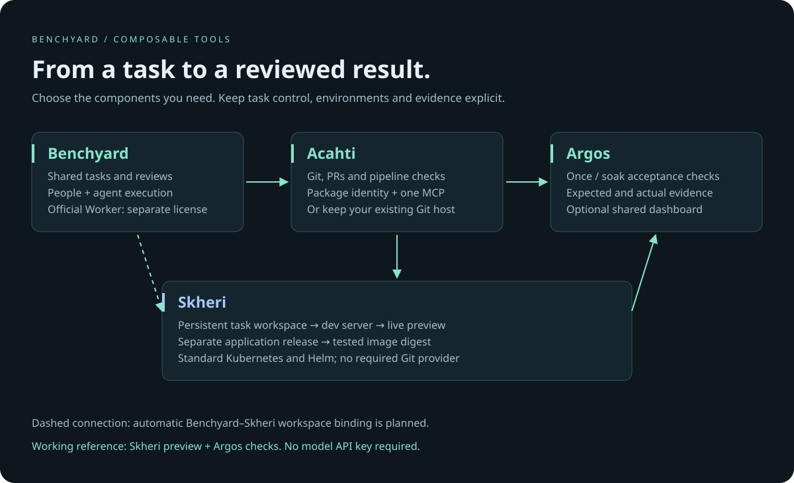

# Benchyard Stack

[Documentation](https://benchyard.github.io/stack/) · [Architecture](docs/architecture.md) · [Working example](docs/use-case.md) · [Comparison](docs/comparison.md)

**Direct the work. Keep the environment. Review the evidence.**

A product group for teams working with coding agents. Each component has one job;
use the pieces you need, keep your existing tools where they fit.

| Product | Job | Start here |
|---|---|---|
| **Benchyard Console** | Shared tasks, documents, reviews and agent execution | [Console](https://github.com/benchyard/benchyard-console) |
| **Acahti** | Self-hosted Git, CI checks, package identity and MCP | [Acahti](https://github.com/lpythu/acahti) |
| **Acahti Plugin** | Cursor and Codex connection guidance | [Plugin](https://github.com/lpythu/acahti-plugin) |
| **Skheri** | Persistent development workspaces, live preview and application releases | [Skheri](https://github.com/benchyard/skheri) |
| **Argos** | Repeatable once/soak checks and local evidence | [Argos](https://github.com/lpythu/argos) |
| **Argos Dash** | Optional team evidence browser | [Dashboard](https://github.com/lpythu/argos-dash) |
| **Argos Pack** | Portable, executable health and preview examples | [Example pack](https://github.com/benchyard/argos-pack) |

## Start with a result

Run a Vite development server in a persistent Skheri workspace, edit a page before
committing, then check that page with Argos. The [working example](docs/use-case.md)
uses public source and no model API key. Add a Git/CI platform or a team workbench
when that solves your next problem.

The intended end-to-end workflow is:

**task → cloud workspace → live preview → evidence → reviewed change → release**

Today, the products expose separate working interfaces. The guide composes them
with standard Git, Helm, Kubernetes and CLI operations. It does not claim that
Benchyard automatically provisions Skheri workspaces or that every agent runtime
is integrated. See [architecture and capability boundaries](docs/architecture.md).

## Principles

- **Agent-readable, human-reviewable.** Explicit commands, structured results and
  evidence are useful to both people and agents.
- **Workspace lifetime follows the task.** Preserve source and dev services across
  agent turns. An individual job finishing must not erase the environment.
- **Preview before commit.** A dev server reads uncommitted files. Production runs
  built artifacts; do not promote a mutable dev directory as a release.
- **Collaboration has ownership.** A shared URL does not grant edit access; a shared
  filesystem does not resolve simultaneous edits. Authenticate participants and
  decide which session owns a task's checkout.
- **Composable adoption.** GitHub, GitLab or another Git host can remain in use.
  Acahti is optional; the stack is not an all-or-nothing migration.

## Licensing and availability

Acahti, Acahti Plugin, Skheri, Argos and the example pack use Apache-2.0 for their
own code. Third-party components retain their original licenses. Benchyard Console
code and its protocol carry Apache-2.0, but the Console repository is not public
yet while its historical deployment configuration is being reviewed. The official Worker remains a private
source component distributed under its existing binary license. This is **not**
a claim that the whole execution stack is open source.

The Console's fake Worker is a deterministic protocol test client, not a functional
coding agent. Choose components with that boundary in mind.

The documentation describes the code reviewed for this publication. Product
capabilities evolve; comparisons link to upstream documentation and make no claim
of universal superiority or benchmark results we have not measured.
