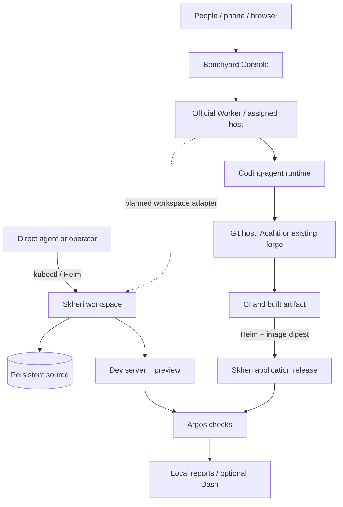

# Architecture and boundaries

The dashed edge is planned. Do not assume Console can create a Skheri workspace
or resume a Kubernetes-hosted task through the current Worker. Skheri's executable
reference path is Helm + kubectl, which an authorized agent can drive directly.

## Three lifetimes

| Object | Lifetime | Owner |
|---|---|---|
| Agent run | One execution / conversation turn | Agent service or Worker |
| Task workspace | Several runs, edits and reviews | Workspace operator |
| Released application | A deployed artifact version | Deployment workflow |

Skheri persists files on a PVC. A replaced pod restarts the dev-server process;
process memory is not persisted. The current Benchyard Worker uses job-scoped
execution/worktrees; automatic mapping to persistent Skheri task workspaces is a
future integration, not an implicit feature of these charts.

## Four boundaries

**Task control:** Benchyard stores task and collaboration state. Official Workers
claim fenced leases and report events. Acahti's inbox concerns delivery state;
it is not a replacement for Benchyard's task UI.

**Code and identity:** Acahti fronts Git, PRs, CI and package operations. Its MCP
connection authenticates the individual member. Git author metadata alone does
not prove which agent ran or authorize a deployment.

**Environment:** Skheri uses existing Kubernetes resources and storage. The
workspace chart preserves editable source; the application chart deploys an image.
There is no cloud provisioning controller, billing service or autosuspend in 0.1.

**Evidence:** Argos runs cases where the CLI is installed, stores local reports and
optionally streams to Dash. A recorded metric is not an assertion unless the case
enforces it. A passing run describes configured checks, not all possible behavior.

## Cloud and mobile

To keep working with a closed laptop, execution and required services must run on
an online cloud host. Browser access, task control, agent subscriptions and HTTPS
preview routing are separate concerns. The reference workflow does not install
Cursor Cloud Agents or replace its control plane. Configure the agent/workbench
and authentication you intend to use before promising a phone-only workflow.

## Trust and isolation

Use scoped access for the operator, agent runtime and CI. Keep credentials out of
source, images and report artifacts. Protect previews with authentication and TLS.
Ordinary Kubernetes pods share the node kernel; namespaces/PVCs do not make hostile
code safe. Strong multi-tenant isolation, per-task delegation and collaborative
session arbitration need additional infrastructure beyond this release.
